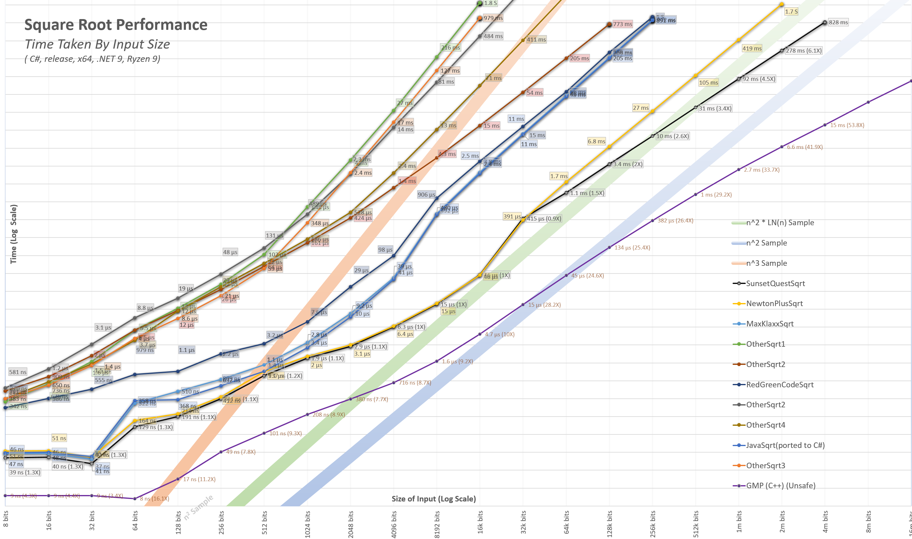

Update: 2/3/2025 - A new version of Sqrt function with a good performance boost for larger numbers will be released in the day or so. The new version is called Newton Plus and is about 2X faster for numbers around 1e1000000. The old version is still available in the repo and is just as fast for smaller numbers.

See CodeProject site for best formated and latest article:  https://www.codeproject.com/Articles/5321399/NewtonPlus-A-Fast-Big-Number-Square-Root-Function

Thank you to the authors at https://www.convertsimple.com/convert-html-to-markdown/ for making a tool to convert this to markdown for here.

Contents
--------

* **[Introduction](#_Introduction)**
* **[C# Version](#_CS_Version)**
    *     [Performance Benchmarks](#_Benchmarks)
    *     [The Code (C# version)](#_CS_Code)
    *     [Floating Point Version / Adapter](#_Floating_Point_Version)
    *     [Round-to-Nearest Integer Version / Adapter](#_Round_to_Nearest_Integer_Version)
    *     [Testing](#_Verification)
* **[Java version](#_Java_Version)**
    *     [Performance Chart](#_Java_Performance_Chart)
    *     [The Code (Java version)](#_Java_Code)
* **[World’s Fastest Square Root for Big Numbers?](#_Worlds_Fastest_Square_Root)**
* **[Optimizations](#_Optimizations)**
    *     [Optimization: Shrinking the division (Newton Plus)](#_Newton_Plus)
        *         [The Code](#_Shrinking_the_division_Code)
        *         [An Example](#_Examples)
        *         [Further Enhancement](#_Further_Enhancement)
    *     [Optimization: Use a starting size, that when doubled repeatedly, ends up at the correct precision.](#_Toc97577214)
        *         [Generate the starting size efficiently](#_Toc97577215)
    *     [Optimization: Using the hardware square root for small numbers directly](#_Toc97577216)
    *     [Optimization: Using the hardware’s double square root for the first 53 bits of larger numbers](#_Toc97577217)
    *     [Optimization: Using precision reached or pre-calculated number of Newton iterations](#_Toc97577218)
    *     [Optimization: Binary search tree for selecting best optimization by scale](#_Toc97577219)
    *     [Optimization: Cast to long before sqrt hardware fast results up to 6.7e7.](#_Toc97577220)
    *     [Optimization: Grow the datatype (BigInteger) with the precision.](#_Toc97577221)
    *     [Optimization: A fast flooring method](#_Toc97577222)
    *     [Optimization: Extend hardware Sqrt to 1.45e17 by flooring result](#_Toc97577223)
    * ~    [Optimization: Use a “+1” on the hardware sqrt for up to 4e31 (Depreciated)](#_Toc97577224)~
    * ~    [Optimization: Checking if over or under by 1. (Depreciated)](#_Toc97577225)~
    * ~    [Optimization: Handling final rounding issues with extra bits from final iteration. (Depreciated)](#_Toc97577226)~
* **[Further optimization Ideas - for the rest of the world to work on](#_Further_Enhancement_Ideas)**
    *     [Possible idea: A faster “val * val”](#_Toc97577228)
    *     [Possible idea: Concatenating “val” and “X/Val” instead of Shifting and Adding](#_Toc97577229)
    *     [Possible idea: Using extra lucky bits](#_Toc97577230)
    *     [Possible idea: Use Mutable Big Integers (Platform Performance improvement)](#_Toc97577231)
    *     [Possible idea: Use a native wrapper in c (Platform Performance improvement)](#_Toc97577232)
* **[How did this function come about?](#_How_did_this_function_come_about)**

Introduction
------------

This article shares a fast square root function for big integers and floats. The algorithm uses a variety of new and existing ideas to calculate the square root with greater efficiency and better performance than other algorithms.  The performance of this function only starts to stand out for numbers above 5 x 1014 (or 252).

The algorithm consists of a core integer square root function and a wrapper for BigFloats.

* **Integer version **\- This function rounds down to the nearest integer(floor).
* **BigFloats / Real number wrapper **– An adapter for the Integer version that adds floating point and optional precision.

The integer square root function has been extensively tested with a variety of test types and benchmarks.

C# Version
----------

### Performance Benchmarks

Benchmarks have been done on this the algorithm throughout the development of it. The benchmarks were first to compare against others and later against itself.  Since there is such a wide range in performance, log scale charts are used for comparisons. Please note that small differences equate to large performance differences. Some Big-O examples have been added as color bands for X3, X2 \* Log(X), and X2. These bands all converge at 0,0 but the bottom of the chart has been removed for better visibility.



For the functions tested, there seemed to be four classes of performance. The time examples are from my test workstation and will vary slightly with different hardware.

* **Big O(cn) **– These take the longest to run for large numbers.  A 40,000-digit binary number would translate to around 1e6000 years. These are not shown in the above chart.
* **Big O(n3) **– These are much faster than the O(cn) algorithms. A 40,000-digit binary number would translate to 500 seconds.
* **Big O(n2 * log(n)) **– These are the much faster and more thought-out algorithms. A 40,000-digit binary takes around just 230ms.
* **Big O(n2) **– This project is consistent with this band or maybe even slightly faster. A 40,000-digit binary number takes around 8ms.

### The Code (C# version)

Just show me the code will you.

    public static BigInteger NewtonPlusSqrt(BigInteger x)
    {
        if (x < 144838757784765629)          // 1.448e17 = ~1<<57
        {
            uint vInt = (uint)Math.Sqrt((ulong)x);
            if ((x <= 4503599761588224) && ((ulong)vInt * vInt > (ulong)x)) //4.5e15 = ~1<<52
            {
                vInt--;
            }
            return vInt;
        }
    
        double xAsDub = (double)x;
        if (xAsDub < 8.5e37)   //   8.5e37 is V<sup>2</sup>long.max * long.max
        {
            ulong vInt = (ulong)Math.Sqrt(xAsDub);
            BigInteger v = (vInt + ((ulong)(x / vInt))) >> 1;
            return (v * v >= x) ? v : v - 1;
        }
    
        if (xAsDub < 4.3322e127)
        {
            BigInteger v = (BigInteger)Math.Sqrt(xAsDub);
            v = (v + (x / v)) >> 1;
            if (xAsDub > 2e63)
            {
                v = (v + (x / v)) >> 1;
            }
            return (v * v >= x) ? v : v - 1;
        }
    
        int xLen = (int)x.GetBitLength();
        int wantedPrecision = (xLen + 1) / 2;
        int xLenMod = xLen + (xLen & 1) + 1;
    
        //////// Do the first Sqrt on hardware ////////
        long tempX = (long)(x >> (xLenMod - 63));
        double tempSqrt1 = Math.Sqrt(tempX);
        ulong valLong = (ulong)BitConverter.DoubleToInt64Bits(tempSqrt1) & 0x1fffffffffffffL;
        if (valLong == 0)
        {
            valLong = 1UL << 53;
        }
    
        ////////  Classic Newton Iterations ////////
        BigInteger val = ((BigInteger)valLong << (53 - 1)) + (x >> xLenMod - (3 * 53)) / valLong;
        int size = 106;
        for (; size < 256; size <<= 1)
        {
            val = (val << (size - 1)) + (x >> xLenMod - (3 * size)) / val;
        }
    
        if (xAsDub > 4e254)                       // 1 << 845
        {
            int numOfNewtonSteps = BitOperations.Log2((uint)(wantedPrecision / size)) + 2;
    
            //////  Apply Starting Size  ////////
            int wantedSize = (wantedPrecision >> numOfNewtonSteps) + 2;
            int needToShiftBy = size - wantedSize;
            val >>= needToShiftBy;
            size = wantedSize;
            do
            {
                ////////  Newton Plus Iterations  ////////
                int shiftX = xLenMod - (3 * size);
                BigInteger valSqrd = (val * val) << (size - 1);
                BigInteger valSU = (x >> shiftX) - valSqrd;
                val = (val << size) + (valSU / val);
                size *= 2;
            } while (size < wantedPrecision);
        }
    
        /////// There are a few extra digits here, lets save them ///////
        int oversidedBy = size - wantedPrecision;
        BigInteger saveDroppedDigitsBI = val & ((BigInteger.One << oversidedBy) - 1);
        int downby = (oversidedBy < 64) ? (oversidedBy >> 2) + 1 : (oversidedBy - 32);
        ulong saveDroppedDigits = (ulong)(saveDroppedDigitsBI >> downby);
    
        ////////  Shrink result to wanted Precision  ////////
        val >>= oversidedBy;
    
        ////////  Detect a round-ups  ////////
        if ((saveDroppedDigits == 0) && (val * val > x))
        {
            val--;
        }
    
        // //////// Error Detection ////////
        // // I believe the above has no errors but to guarantee the following can be added.
        // // If an error is found, please report it.
        // BigInteger tmp = val * val;
        // if (tmp > x)
        // {
        //     throw new Exception("Sqrt function had internal error - value too high");
        // }
        // if ((tmp + 2 * val + 1) >= x)
        // {
        //     throw new Exception("Sqrt function had internal error - value too low");
        // }
    
        return val;
    }

### Floating Point Version / Adapter

With this project, I also wanted to make a BigFloat version for large floating points. To do this, a few BigFloat versions were constructed from scratch. Despite this, all that was needed was a simple wrapper function for the BigInteger version. BigFloat and BigInteger versions are roughly the same. An encapsulating function, shown below, simply adds some spice to the BigInteger version for keeping track of the precision and shifts.

    (BigInteger val, int shift) SunsetQuestSqrtFloatUsingIntVersion(BigInteger x, int shift = 0, int wantedPrecision = 0)
    {
        int xLen = (int)x.GetBitLength();
        if (wantedPrecision == 0) wantedPrecision = xLen;
        if (x == 0) return (0, wantedPrecision);
        int totalLen = shift + xLen;
        var needToShiftInputBy = (2 * wantedPrecision - xLen) - (totalLen & 1);
        var val = SunsetQuestSqrt(x << needToShiftInputBy);
        var retShift = (totalLen + ((totalLen > 0) ? 1 : 0)) / 2 - wantedPrecision;
        return (val, retShift);
    }

The pre/post calculations are relatively simple.  In a nutshell, the precision we get out of the Sqrt function is half what we put in.  So, if we want 20-bits of precision then we just scale the size of the input X to be 40 bits. 

The shifts are mostly straightforward calculations.  The “(totalLen & 1)” is required to make sure we shift by an even amount.  For example, the binary Sqrt of 10000 is 100. This result is simply a right-shift by an even number. If we had Sqrt of 100000(aka 32) then the Sqrt is 101(aka 5) and this is not a simple right shift anymore. We just need to keep the input length an odd number in length. 

The `(totalLen > 0) ? 1 : 0)` part is because we always want to round to negative infinity for the return shift.

### Round-to-Nearest Integer Version / Adapter

The `Sqrt` functions here all round down to the nearest integer. This is the standard for integer functions. If the result of a sqrt function is 99.999999998 then it should be rounded down to 99.  However, in some cases a rounding-to-nearest-integer is preferred. To do this, all that is needed is to calculate one extra bit of precision with the standard integer sqrt function. If that extra ends up being a zero, then it would be rounded down or else if a “1” bit then rounded up.   
  
So, something like:

    BigInteger SqrtNearestInt(BigInteger x)
    {
        x <<= 2; // left shift by 2
        var result = SunsetQuestSqrt(x);
        if (result & 1 ==1)
             result ++;
        return (res >> 1); //right shift by 1
    }

note: this is untested

### Testing

For this algorithm, extensive testing has been done and I believe all then errors have been removed. However, to guarantee this, the following can be added near the end. It will have around a 10% performance cost.

    BigInteger sqrd = val * val;
    if (sqrd > x)
    {
        Console.WriteLine($"val^2 ({tmp1}) < x({x})  off%:{((double)(tmp1)) / (double)x}");
        throw new Exception("Sqrt function had internal error - value too high");
    }
    if ((sqrd + 2 * val + 1) >= x)
    {
        Console.WriteLine($"(val+1)^2({(sqrd + 2 * val + 1)}) <= x({x})");
        throw new Exception("Sqrt function had internal error - value too low");
    }

A considerable amount of time was spent in testing the integer sqrt. It ran for several days on a 32 thread 1950x threadripper with no errors.   
Tests include: 

* Verification 1: Common issues in the past number testing
* Verification 2: Brute Force Testing (Zero and up) \[Ran up to 3.4e11 or 237\]
* Verification 3: 2n \+ \[-5 to +5\] Testing
* Verification 4: n\[2 to 7\] \+ \[-2 to 2\] Testing
* Verification 5: n2 –\[0,1\] Testing – overlaps with Verification 4 but tests larger numbers
* Verification 6: Random number testing  

The amount of testing has been extensive so hopefully there are no errors, however, if any are found then please report it.

Note: Java’s `Sqrt` function was converted line by line from Java to C# but for some reason there are occasional errors in the last few bits when converted and run in C#. This is probably some rounding difference and has not been investigated.  Java’s `Sqrt` (in Java) does not have these errors.

Java version
------------

Since Java is one of the most used programming languages, I also wanted to create a Java version. I basically took the C# version and made some adjustments to it. My Java skills are minimal so I’m sure more optimizations can be done.  Using the Norton Plus it is still about 15X-45X faster than the built in Java BigInteger Sqrt for numbers between 64 bits and 10240 bits in length.  For numbers under 64 bits in length, the built-in Java version has the advantage because it can use private Java libraries.  For numbers over 64 bits, Newton plus is much faster, however, if we use private java BigInteger methods and MutableBigInteger then we can achiever even greater performance.

### Performance Chart

The points below represent an average score for a random number of with different sizes. The gray points are the performance of Java’s Big Integer. The orange is this paper’s Newton Plus. Each dot represents the average of two trails where each trial was a loop of thousands to millions of tests.

Random Notes:

* The yellow is the speed-up. It is just the NewtonPlus / JavasSqrt.
* It is up to 50X (5000%) faster for numbers around 10240 bits in length. For larger numbers, I would expect this to be even higher like the C# chart.


Below we zoomed in on the vertical direction to get better look.


A logarithmic view provides the best look.  I think this is best at showing the comparison. Each horizontal line represents a 2X performance gain. A yellow speed-up is also shown here that uses the right-side axes. The speedup is just the NewtonPlus time divided by the Java version.


### The Code (Java version)

public static BigInteger NewtonPlusSqrt(BigInteger x) {
    if (x.compareTo(BigInteger.valueOf(144838757784765629L)) < 0) {
        long xAsLong = x.longValue();
        long vInt = (long)Math.sqrt(xAsLong);
        if (vInt * vInt > xAsLong)
            vInt--;
        return BigInteger.valueOf(vInt);  }

    double xAsDub = x.doubleValue();
    BigInteger val;
    if (xAsDub < 2.1267e37) // 2.12e37 largest here since sqrt(long.max*long.max) > long.max
    {
        long vInt = (long)Math.sqrt(xAsDub);
        val = BigInteger.valueOf((vInt + x.divide(BigInteger.valueOf(vInt)).longValue()) >> 1);
    }
    else if (xAsDub < 4.3322e127) {
        // Convert a double to a BigInteger
        long bits = Double.doubleToLongBits(Math.sqrt(xAsDub));
        int exp = ((int) (bits >> 52) & 0x7ff) - 1075;
        val = BigInteger.valueOf((bits & ((1L << 52)) - 1) | (1L << 52)).shiftLeft(exp);

        val = x.divide(val).add(val).shiftRight(1);
        if (xAsDub > 2e63) {
            val = x.divide(val).add(val).shiftRight(1);  }
    }
    else // handle large numbers over 4.3322e127
    {
        int xLen = x.bitLength();
        int wantedPrecision = ((xLen + 1) / 2);
        int xLenMod = xLen + (xLen & 1) + 1;

        //////// Do the first Sqrt on Hardware ////////
        long tempX = x.shiftRight(xLenMod - 63).longValue();
        double tempSqrt1 = Math.sqrt(tempX);
        long valLong = Double.doubleToLongBits(tempSqrt1) & 0x1fffffffffffffL;

        if (valLong == 0)
            valLong = 1L << 53;

        //////// Classic Newton Iterations ////////
        val = BigInteger.valueOf(valLong).shiftLeft(53 - 1)
                .add((x.shiftRight(xLenMod - (3 * 53))).divide(BigInteger.valueOf(valLong)));

        int size = 106;
        for (; size < 256; size <<= 1) {
            val = val.shiftLeft(size - 1).add(x.shiftRight(xLenMod - (3 * size)).divide(val)); }

        if (xAsDub > 4e254) // 4e254 = 1<<845.77 
        {
            int numOfNewtonSteps = 31 - Integer.numberOfLeadingZeros(wantedPrecision / size) + 1;

            ////// Apply Starting Size ////////
            int wantedSize = (wantedPrecision >> numOfNewtonSteps) + 2;
            int needToShiftBy = size - wantedSize;
            val = val.shiftRight(needToShiftBy);

            size = wantedSize;
            do {
                //////// Newton Plus Iteration ////////
                int shiftX = xLenMod - (3 * size);
                BigInteger valSqrd = val.multiply(val).shiftLeft(size - 1);
                BigInteger valSU = x.shiftRight(shiftX).subtract(valSqrd);
                val = val.shiftLeft(size).add(valSU.divide(val));
                size *= 2;
            } while (size < wantedPrecision);
        }
        val = val.shiftRight(size - wantedPrecision);
    }

    // Detect a round ups. This function can be further optimized - see article.
    // For a ~7% speed bump the following line can be removed but round-ups will occur.
    if (val.multiply(val).compareTo(x) > 0)
        val = val.subtract(BigInteger.ONE);

    // // Enabling the below will guarantee an error is stopped for larger numbers.
    // // Note: As of this writing, there are no known errors.
    // BigInteger tmp = val.multiply(val);
    // if (tmp.compareTo(x) > 0)  {
    //     System.out.println("val^2(" + val.multiply(val).toString() + ") >=  x(" + x.toString() + ")"); 
    //     System.console().readLine();
    //     //throw new Exception("Sqrt function had internal error - value too high"); 
    // }
    // if (tmp.add(val.shiftLeft(1)).add(BigInteger.ONE).compareTo(x) <= 0) {
    //     System.out.println("(val+1)^2(" + val.add(BigInteger.ONE).multiply(val.add(BigInteger.ONE)).toString() + ") >=  x(" + x.toString() + ")"); 
    //     System.console().readLine();
    //     //throw new Exception("Sqrt function had internal error - value too low"); 
    // }

    return val;
}

World’s Fastest Square Root for Big Numbers?
--------------------------------------------

The World's fastest for Java and C#... I think so. But this project is not the world's fast square root.

The fastest that I have found is the GMP Square Root. It is considerably faster. One of the reasons is GMP/MPIR is faster is it is written in assembly and c – both low level languages.  When writing in asm/c the hardware architecture can be used to its fullest including SSE/MXX 128-bit instructions/registers, optimizing cache, and other close-to-metal tricks/instructions.

Here are some very rough comparisons: (in ns)

|     | GMP | This Project | Speed-Up |
| --- | --- | --- | --- |
| 1E+77 | 350 | 1058 | 3.0X |
| 1E+154 | 650 | 2715 | 4.2X |
| 1E+308 | 1150 | 5330 | 4.6X |
| 1E+616 | 1650 | 7571 | 4.6X |
| 1E+1233 | 2450 | 14980 | 6.1X |
| 1E+2466 | 4250 | 35041 | 8.2X |
| 1E+4932 | 6650 | 121500 | 18X |
| 1E+9864 | 17650 | 458488 | 26X |
| 1E+19728 | 51850 | 1815669 | 35X |
| 1E+39457 | 144950 | 6762354 | 47X |

Optimizations
-------------

All this speedup is done with different optimizations, tricks, techniques, technologies, creative ideas or whatever we want to call them. Each one of these ideas adds to the overall performance. The ideas here come from myself and others.

First off, let’s review the basics. There are a few long-time known methods of finding a square root and the most popular is Newton’s method (also known as the Babylonian method or Heron’s method). It can be summarized into:

    Let x = the number we want to find the sqrt of
    Let v = a rough estimate of Sqrt(x)
    while(desired_precision_not_met) 
        v = (v + x / v) / 2
    return v

When calculating a square root using Newton’s method (and other methods), we start by finding the most significate digits. This first step can be done by choosing a number that is half the number of bits as the inputs. So, the number 2101 (a 1 with 101 zeros in binary) will have a good starting point of around 251. This roughly gets us started with one bit of accuracy at the correct scale.

Then it’s time for the Newton iterations. For each iteration of `v = (v + x / v) / 2` the number of digits in precision, doubles. An initial 1-bit guess doubled to 2 bits of accuracy, then 4, then 8, etc.  (Note: shifts left out for simplicity)

_Initial Guess:                                        100000000000000000000000000000000000000000000000000…  
Iteration 1 of v = (v + x / v) / 2:           110000000000000000000000000000000000000000000000000…  
Iteration 2 of v = (v + x / v) / 2:           101101010101010101010101010101010101010101010101010…  
Iteration 3 of v = (v + x / v) / 2:           101101010000010100000101000001010000010100000101000…  
Iteration 4 of v = (v + x / v) / 2:           101101010000010011110011001100111111101010111110110…  
Iteration 5 of v = (v + x / v) / 2:           101101010000010011110011001100111111100111011110011…_

It helps to view this in binary – as shown from the growing underlined correct bits above. In decimal (base10) this would be completely hidden. There are some insights in doing math in binary.

Okay, now that the basics are out of the way, let’s explore at the different optimizations. I will start out with some important new ones I found along with the more important ones so check out the first few at least.

### Optimization: Shrinking the division (Newton Plus)

Okay, let me start out with my #1 optimization.

When calculating newtons method, the costliest part is the division. Division is time consuming for computers and humans alike. If somehow this division can be shrunk, it would put us in a much better place in terms of the work needed for the calculation.

When doing typical Newton iterations by hand in binary something jumps out. The “v +” is just the previous iteration of v tacked on the front. Furthermore, these bits are already there so we are just upshifting the top half by 1.  If we already have these bits, do we really need to have them in the divide?  Can we somehow remove this part since we have it already?  The answer is they don’t need to be in the divide. These bits are the first bits of the result, v.  Remember the bits in V2 are x so if we just remove the V2 then after it goes through the sqrt it would be like we just removed v, the thing we are trying to pre-remove.

A way to look at what “v +” is doing in the classical Newton I that it is just shifting the left side of “x/v” by one.  In this example the “V +” is just injecting the red zero.

Copy Code

_  v +    = **101101010000010**0000000000000000  
  x / v  = **101101010000010**1111001100110011  
  Sum:     **1011010100000101111001100110011**_

_note: Notice the “V +” is just upshifting the top half by 1._

So, we already have half the bits here, so why keep then in the divide!  When looking at the classical Newton above the X / V =  1011010100000101111001100110011. If we look at the x/v part, it can be thought of as two parts.  There is the top half that is in bold that we already know because it already exists in the current v.  And the bottom half has the current the part we are short on. We only need to work with the bottom bits.

To remove the leading v bits, the top half, we can deduct V2 from x in the numerator.  The first half of the bits in V2 are the top bits of x.  So, we are removing the V2 from x before the sqrt calculations or just v after the calculation.

Here is what it looks like if we pre-remove V2 from x.

_  "V +"          = **1011010100000100**0000000000000000  
  (X - V2) / V = 1111001100110011  
  sum:              **1011010100000100**1111001100110011_

Or we can do it without using add but and just concatenate the bits.

_  "V" concatenated with "(X-V^2)/V"  
    = 1011010100000100 concatenated with 1111001100110011  
    = 10110101000001001111001100110011_

  

#### The Code for Newton Plus

Below would be one iteration of Newton Plus. This should be repeated until the desired precision is met.

    void NewtonPlus(BigInteger x, int xLenMod, ref int size, ref BigInteger val)
    {
        int shiftX = xLenMod - (3 * size);
        BigInteger valSqrd = (val * val) << (size - 1);
        BigInteger valSU = (x >> shiftX) - valSqrd;
        val = (val << size) + (valSU / val);
        size *= 2;
    }

The parameters:

* "X" is The input. The value we are trying to find the Sqrt of.
* "xLenMod" is Len(X) rounded up to the next even number. It is just calculated once.
* "size" is a maintained current size of val. This is so it does not need to be recalculated each time the method below is called. The size is also doubled when the method is called.
* "val" is the current result. With each call to this function, it doubles in size (and precision).

Just for comparison, here is a typical Newton.

    void NewtonClassic(BigInteger x, int xLenMod, ref int size, ref BigInteger val)
    {
        BigInteger tempX = x >> xLenMod - (3 * size) + 1;
        val = (val << (size - 1)) + tempX / val;
        size <<= 1;
    }

  

In the simplest form, it looks like…

**Vn+1 = (Vupshifted) \+ (Xdownshifted \- V2upshifted) / V**

With more detail…

**XLenMod = IntLog2(X) + (IntLog2(X) mod 2) Vn+1  
=(V << (IntLog2(V)+1)) + (\[X >> ((XLenMod - 3 * IntLog2(V)) - (V2 << IntLog2(V))\] / V)**

Or with concatenation…

**Vn+1=V Concat with (\[X >> ((XLenMod - 3 * IntLog2(V)) - (V2 << IntLog2(V))\] / V)**

Notes:

* For the concatenate method to work we must have the V part exact. If the “Xdownshifted \- V2upshifted” results in a negative number, then it is not exact.
* Since at this point the “V +” or more precisely “(V << (IntLog2(V) + 1)) +” is just left shifting V in front and then adding we can just do a concatenation.  Shifting V and then adding the two is a lot more work when they could just simply be concatenated.

#### An Example of Newton Plus

Let’s say we want to find the square root of 123456789 (111010110111100110100010101).

We will start in **Line 3(**See table below) with a v of “101” here. (Note: The first few bits can be estimated using the binary length of the number we are trying to find the Sqrt(x). If even, we start with “110” else if odd we start with “101”. The above has 27 digits so our initial pick is “101”.)

First, we do a classic Newton Step in **Lines 5-7**. We are using the classic Newton step here because it is faster on small numbers since, we have 64-bit registers anyway, but also in this example it doubles to show how the classic Newton version looks.

Then on **Lines 8-14**, a Newton Plus iteration is completed.  **Line 8** is v squared and then left shifted.

Then on **Line 10,** we pre-subtract out the V2 from x.  This is the magical step here. We remove V2 do the sqrt, then add just V back in.

On **Line 12**, we do the typical divide but with a smaller numerator then the standard Newton.

On **Line 13**, we upshift V and then add it to T on **Line 14**.  One could argue though that we “Add V” with the standard Newton so how is this any different?  It is different because we are restoring V back in verses with the standard Newton the “Add V” is just upshifting the top half of the bits by 1.

|     |     |     |     |     |     |
| --- | --- | --- | --- | --- | --- |
| Line |     |     | Decimal | Binary | Len |
| 1   | Number: |     | 123456789 | 111010110111100110100010101 | \[27\] |
| 2   |     |     |     |     |     |
| 3   | Initial Pick | V=27(is odd) | 5   | 101 | \[3\] |
| 4   |     |     |     |     |     |
| 5   | Newton Step | Shift X >> | 29  | 11101 | \[5\] |
| 6   |     | X/V | 5   | 101 | \[3\] |
| 7   |     | V=V+↑ | 10  | 1010 | \[4\] |
| 8   | NewtonPlus Step | V2, << | 800 | 1100100000 | \[10\] |
| 9   |     | Shift X >> | 941 | 1110101101 | \[10\] |
| 10  |     | X-V2 | 141 | 10001101 | \[8\] |
| 12  |     | T=(X-V2)/V | 14  | 1110 | \[4\] |
| 13  |     | Shift V << | 160 | 10100000 | \[8\] |
| 14  |     | V=T+(V<<) | 174 | 10101110 | \[8\] |
| _15_ | _True answer_ |     | _173_ | _10101101_ | _\[8\]_ |
| _16_ | _Off by_ |     | _1_ | _1_ | _\[1\]_ |
| 17  | NewtonPlus Step | V2, << | 3875328 | 1110110010001000000000 | \[22\] |
| 18  |     | Shift X >> | 3858024 | 1110101101111001101000 | \[22\] |
| 19  |     | X-V2 | 17304 | 100001110011000 | \[15\] |
| 20  |     | T=(X-V2)/V | 99  | 01100011 | \[8\] |
| 21  |     | Shift V << | 44544 | 1010111000000000 | \[16\] |
| 22  |     | V=T+(V<<) | 44445 | 1010110110011101 | \[16\] |
| _23_ | _True answer_ |     | _44444_ | _1010110110011100_ | _\[16\]_ |
| _24_ | _Off by_ |     | _1_ | _1_ | _\[1\]_ |
| 25  | NewtonPlus Step | V2, << | 6.47285E+13 | 1110101101111011001001001001001000000000000000 | \[46\] |
| 26  |     | Shift X >> | 6.47269E+13 | 1110101101111001101000101010000000000000000000 | \[46\] |
| 27  |     | X-V2 | 1618771968 | 1100000011111001000000000000000 | \[31\] |
| 28  |     | T=(X-V2)/V | 36421 | 1000111001000101 | \[16\] |
| 29  |     | Shift V << | 2912747520 | 10101101100111010000000000000000 | \[32\] |
| 30  |     | V=T+(V<<) | 2912711099 | 10101101100111000111000110111011 | \[32\] |
| _31_ | _True answer_ |     | _2912711096_ | _10101101100111000111000110111000_ | _\[32\]_ |
| _32_ | _Off by_ |     | _3_ | _11_ | _\[2\]_ |

  

Here it is in more of a math-like format…


Or with concatenation…  
               

Random Notes:

*  is simply the length in bits of the input X.
*  is only calculated once.   Basically, if the length of X is odd then we add 1. This number should be always even.

#### Further Enhancing Newton Plus

In the above we are calculating the full answer of v2 but we really only need to calculate the bottom half. The top half of v2 already exists in x. So, instead of doing the full v2 in "v2 \- x" we only need to calculate the bottom half of the digits of V2 and can then stop.  At this point though the x still has these bits also so they would need to be removed as well. We really just need a middle portion of x for this. 

Calculating the bottom half of v2 and then subtracting a subset of bits in x will give us the new bits. These new additional bits can then be appended to the current v we have been building.

I attempted this in C# but .NET’s BigInteger does not really allow us to calculate only the bottom half of v*v.  I did try the `ModPow()` but it did not seem like the performance was that great because `ModPow()` is doing division where I really just want to stop calculating v*v halfway throw.  Also, my implementation had some errors and was not always correct.  A custom BigInteger class would probably need to be built.

    void NewtonPlus(BigInteger x, int xLenMod, ref int size, ref BigInteger val)
    {
        BigInteger tmp2 = (BigInteger.ModPow(val, 2, BigInteger.One << (size + 1)) << (size));
        BigInteger tmp3 = ((x >> (xLenMod - (3 * size))) & ((BigInteger.One << (2 * size + 1)) - 1));
        BigInteger valSU2 = tmp3 - tmp2;
    
        val = (val << (size + 1)) + (valSU2 / val);
        size = (size << 1) + 1;
    }

  

**Impact:** Medium

**Used by:** none – personal idea (The name “Newton Plus” is just a name I assigned.)

### Optimization: Use a starting size, that when doubled repeatedly, ends up at the correct precision.

We figure out an initial size so if we keep doubling it, it will end up with the precision we want.

Say the result is expected to be 600-bits in size and we get an initial free guess with 64 bits of known accuracy. If we used newton to keep doubling, we get 128, 256, 512, and then we do a partial at 579.

|     |     |     |     |     |     |     |     |     |     |     |     |
| --- | --- | --- | --- | --- | --- | --- | --- | --- | --- | --- | --- |
|     | 64-bit Memory Segments for BigInteger Storage |     |     |     |     |     |     |     |     |     | Time |
| Initial Value | 64  |     |     |     |     |     |     |     |     |     | 0   |
| Newton Loop 1 | 64  | 128 |     |     |     |     |     |     |     |     | 2*2=4 |
| Newton Loop 2 | 64  | 128 | 192 | 256 |     |     |     |     |     |     | 4*4=16 |
| Newton Loop 3 | 64  | 128 | 192 | 256 | 320 | 384 | 448 | 512 |     |     | 8*8=64 |
| Newton Loop 4 | 64  | 128 | 192 | 256 | 320 | 384 | 448 | 512 | 576 | 640 | 9*9=81 |

Now we can improve on this by starting on a size that if we keep doubling it will result in the target size, or slightly larger.

|     |     |     |     |     |     |     |     |     |     |     |     |
| --- | --- | --- | --- | --- | --- | --- | --- | --- | --- | --- | --- |
|     | 64-bit Memory Segments for BigInteger Storage |     |     |     |     |     |     |     |     |     | Time |
| Initial Value | 37  |     |     |     |     |     |     |     |     |     | 0   |
| Newton Loop 1 | 64  | 74  |     |     |     |     |     |     |     |     | 2*2=4 |
| Newton Loop 2 | 64  | 128 | 148 |     |     |     |     |     |     |     | 3*3=9 |
| Newton Loop 3 | 64  | 128 | 192 | 256 | 296 |     |     |     |     |     | 5*5=25 |
| Newton Loop 4 | 64  | 128 | 192 | 256 | 320 | 384 | 448 | 512 | 576 | 592 | 9*9=81 |

Each empty block versus the previous table is a saved calculation.

There is still a way to improve of this even more.  If we look at the example table above, we ended up at 592. That is 13 bits more then we needed. And in the step before that we have 7 bits more then we need. This is because our starting size of 64 bits was small, so it did not give us very much resolution. What we can do instead is start with a max initial value of 128. We can get this simply by using our 64 initial and doing one newton iteration. This Newton iteration would be very fast since it is so small. But now if we do this again using the larger number, we will get 73. (579 -> 290 -> 146 -> 73) When we keep doubling this with 73 back up, we get 73 -> 146 -> 292 -> 584.  Notice we now only calculated 584 bits and not 592 like before. This is closer to our target of 579.  In this example it would not have sped anything up but if there was a “Loop 5/6” row some blocks would disappear.

Overall, the larger the target size the larger the initial size should be. For this algorithm, I skip this on small numbers, and do the right sizing around 500 bits. 

One other approach is to re-adjust several times.  Maybe right size on every nth iteration.

#### Generate an efficient starting size

To generate a starting size, we can start with the full size, then keep halving it until it until it is small enough to fit in an initial guess.   579 -> 290 -> 146 -> 74 -> 37.  So, 37 would be our starting point.  Something like:

    int startingSize = expectedOutputSize; 
    while (startingSize > 64) 
    {   startingSize >>= 1; 
        doublingCt++; 
    }

  

Here` startingSize` would contain the initial size we need.  64 bits is the accuracy of our initial guess in this example. And `doublingCt` would be how many Newton iterations we need to do.

Another way to do this that works well for large numbers:

    int doublingCt = BitOperations.Log2((uint)((wantedPrecision – 1) / 64)) + 1;
    int startingSize = ((wantedPrecision – 1) >> doublingCt) + 1;

  

**Impact:** Major (no impact on numbers below 4e127, large impact on larger numbers)

**Used by:** None – personal idea

### Optimization: Using the hardware square root for small numbers directly

We can use the built-in hardware square root function that exists on most processors today. A double floating point square root function will take in up to 53 significate binary digits and give us 26 bits of precision on the output.

Using the built-in floating-point, exposed with`Math.Sqrt(someDouble)` in C#, will yield the exact answer up to 13 bits in precision and for results up to 28-bits it may round up.  So, functions can try and use the hardware Sqrt directly when the input is small. This does not work well if the input is over 53-bits in size.  This trick has been used by many different square root implementations like Java’s BigInteger Square root function. 

|     |     |     |
| --- | --- | --- |
| Double-Precision Hardware Square Root Precision |     |     |
| Input Range (Bit size) | 0-26 | 26-57 |
| Input Range (number) | 0 – 67108863 | 67108864 - 2^57 |
| Output Accuracy in Bits | 13 bits | 28.5 bits |
| Output Accuracy as Number | 0 – 8,191 | 8192 - 379625062 |
| Accuracy | Exact! (Always rounded down) | Either Rounded Up or Down |

  

**Impact:** Major (on smaller numbers only)

**Class:** Hardware-Software-Specific (hardware feature)

**Used by:**  commonly used – The first use I could find of using a double’s square root for smaller numbers (under double.max)

* “refactor”, Jun 29, 2000, [Square Root of a BigInteger in Google Groups](https://groups.google.com/g/comp.lang.java.programmer/c/dcGNwTpKHUc/m/AfZuIdQ0Bj8J)
* Peter Lawrey, Dec 10 2010  [https://stackoverflow.com/questions/4407839/how-can-i-find-the-square-root-of-a-java-biginteger/4407948#4407948](https://stackoverflow.com/questions/4407839/how-can-i-find-the-square-root-of-a-java-biginteger/4407948#4407948)
* Mar 23 ‘16 at 20:15 [https://stackoverflow.com/a/36187890/2352507](https://stackoverflow.com/a/36187890/2352507)

### Optimization: Using the hardware’s double square root to initialize the first 53 bits of larger numbers

If we want to find the square root of a larger number that is over the 53-bits we can get directly from the hardware, we can just reduce the size by right shifting it, then do the hardware square root, then re-inflate the size by left shifting. This will leave us with the answer but only with the first 53 bits.

Say we want to find the square root of 2596139662575945865093856568695112. Our number has a length of 111 bits...

111111111111111111000111010110001011100110111110011111100111001010101011110010010110001101010100101100101001000

Now this is too large to fit in a hardware square root. So, let’s truncate it to fit in 53 bits. We can remove 2 bits at a time (not 1!!!). We need to remove any multiple 2 bits at a time because that is essentially like pulling out a 4, 16, 64, etc. When taking this out before the square root it would be easy to put back in. So, if we pull out five 2-bit pairs (or right shift 10) we would just re-add five bits back by left shifting 5 after performing the hardware square root.

We can remove the right-side by doing a right-shift of 58(29x2) to make it 53 bits…

11111111111111111100011101011000101110011011111001111

We would then need to put this in the fraction part of a double floating point and then do a hardware square root. The output, in the fraction bits of a double, would look like this:

11111111111111111110001110101100010110110100111000001

Great, now we have the first 53-bits of the number, but we really need 56 bits for the whole answer. We can follow this up with a newton iteration to get the extra precision we need. Using one newton iteration doubles the 53-bits to 106-bits – enough for the 56 bits of precision we need.

For small numbers this gives us a nice boost but unfortunately for larger numbers this boost becomes less relevant.  This optimization does not help with the BigO performance. We are saving around five Newton iterations at the start, and these are the quickest to compute iterations as well. We are basically saving ourselves a fixed amount of time off any larger sqrt function.

On my CPU it saves about 0.8 µs on a calculation.  On a smaller number, like 1e14, this is very noticeable (0.85µs to .05µs is a 16X speedup) however as the numbers get into the big number territory the 0.8µs becomes irrelevant.  Something that would have taken 1 ms would take 0.9992 ms with this optimization. Big-O notation would skip this optimization since it is a constant speedup.

**Impact:** Major (on smaller numbers only, no BigO help)

**Used by:**

* Patricia Shanahan, Jun 30, 2000.  \[mentioned only\] [https://groups.google.com/g/comp.lang.java.programmer/c/dcGNwTpKHUc/m/yU8ObqKK7-AJ](https://groups.google.com/g/comp.lang.java.programmer/c/dcGNwTpKHUc/m/yU8ObqKK7-AJ), [https://groups.google.com/g/comp.lang.java.programmer/c/PlfTNI7OU4g/m/sWhmE3Yuu60J](https://groups.google.com/g/comp.lang.java.programmer/c/PlfTNI7OU4g/m/sWhmE3Yuu60J)
* Fava, September 8, 2007 [http://allergrootste.com/big/Retro/blog/sec/archive20070915_295396.html](http://allergrootste.com/big/Retro/blog/sec/archive20070915_295396.html)
* Brian Burkhalter, September 24, 2015 on 11:27, [bugs.openjdk.java.net/browse/JDK-4851777](https://bugs.openjdk.java.net/browse/JDK-4851777?focusedCommentId=13847456&page=com.atlassian.jira.plugin.system.issuetabpanels%3Acomment-tabpanel#comment-13847456)
* jddarcy, May 20, 2016, [https://github.com/openjdk/jdk/commit/4045a8be07195acac7fb2faef0e6bf90edcaf9f8](https://github.com/openjdk/jdk/commit/4045a8be07195acac7fb2faef0e6bf90edcaf9f8)
* Java’s BigDecimal Sqrt method since version 9. [java/9 : java.base/java/math/MutableBigInteger.java (yawk.at)](https://code.yawk.at/java/9/java.base/java/math/MutableBigInteger.java#java.math.MutableBigInteger%23sqrt())
* Max Klaxx, September 15, 2020  [https://stackoverflow.com/questions/3432412/calculate-square-root-of-a-biginteger-system-numerics-biginteger/63909229#63909229](https://stackoverflow.com/questions/3432412/calculate-square-root-of-a-biginteger-system-numerics-biginteger/63909229#63909229)

### Optimization: Using precision reached or pre-calculated number of Newton iterations

When doing the Newton’s by hand in binary one can quickly see that each iteration doubles the precision. The number of steps can be pre-calculated or the precision can be monitored as the answer grows.  This is better than checking to see if the answer is correct or has stopped changing as that requires more compute.

    shiftX = xLenMod - (3 * size);
    while (size < wantedPrecision)  <-----Escape here when desired precision met.
    {
       BigInteger topOfX2 = (x >> shiftX);
       BigInteger valSquared4 = (val * val) << (size - 1);
       BigInteger valSU = topOfX2 - valSquared4;
       BigInteger div = valSU / val;
       val = (val << size) + div;
       shiftX -= 3 * size;
       size <<= 1;
    }

  

**Impact:** Major

**Class:** Fundamental

**Used by:** not used for integer square roots before, but has been used for floating point square roots:

* Fava, 8 September 2007 - [Java BigDecimal square root method (archive.org)](https://web.archive.org/web/20180409195411/http:/allergrootste.com/big/Retro/blog/sec/archive20070915_295396.html)
* Brian Burkhalter, September, 9 2015, [\[JDK-4851777\] Add BigDecimal sqrt method - Java Bug System](https://bugs.openjdk.java.net/browse/JDK-4851777?focusedCommentId=13847456&page=com.atlassian.jira.plugin.system.issuetabpanels%3Acomment-tabpanel#comment-13847456)

### Optimization: Binary search tree for selecting best optimization by scale

A binary tree that can find the best method to handle an input of a given size is useful. This is borderline obvious and the impact on this is minor, but I wanted to include it. 

The below example shows 4 levels deep…


**Impact:** Minor

### Optimization: Cast to long before sqrt hardware fast results up to 6.7e7.

This one might be a C# thing but casing a double to long before the sqrt will result in a little bit of extra performance.  

Example:

    if (xAsDub < 67108864) 
    {
        return (int)Math.Sqrt((ulong)xAsDub);
    }

  

This only works for numbers under 67108864.

**Impact:**  Numbers less than 257: Major;  Numbers greater than 257: None (or minor negative impact)

**Class:** Hardware-Software-Specific (complier/language feature - may only apply to C#)

**Used by:** For this project, I used the idea from:

* Max Klaxx, March 2021  [https://stackoverflow.com/questions/3432412/calculate-square-root-of-a-biginteger-system-numerics-biginteger/63909229#63909229](https://stackoverflow.com/questions/3432412/calculate-square-root-of-a-biginteger-system-numerics-biginteger/63909229#63909229)

### Optimization:  Grow the datatype (BigInteger) with the precision.

This optimization is borderline obvious, but I will include it. When performing Newton’s method, only spend time calculating the bits that are in-precision. We may get some initial guess, say 53 bits, so we do not need to start working on a container the full size of the result at the start. It is only the last step we would do this.  

If one just did Newton’s method directly using **_while(desired\_precision\_not_met) V = (V + X/V) / 2_ **without downshifting, they we are doing lots of un-needed compute. It seems obvious but, in the beginning, this is not clear.

To show this, say we are calculating the sqrt of some number that is 600 bits. A naive approach would be to work with all the 600 bits of “X” the entire time. The table below shows the time taken of working with the full width the entire time.

|     |     |     |     |     |     |     |     |     |     |     |     |
| --- | --- | --- | --- | --- | --- | --- | --- | --- | --- | --- | --- |
|     | 64-bit Memory Segments For BigInteger Storage |     |     |     |     |     |     |     |     |     | Time |
| Newton Loop 1 | 64  | 128 | 192 | 256 | 320 | 384 | 448 | 512 | 576 | 600 | 9*9=81 |
| Newton Loop 2 | 64  | 128 | 192 | 256 | 320 | 384 | 448 | 512 | 576 | 600 | 9*9=81 |
| Newton Loop 3 | 64  | 128 | 192 | 256 | 320 | 384 | 448 | 512 | 576 | 600 | 9*9=81 |
| Newton Loop 4 | 64  | 128 | 192 | 256 | 320 | 384 | 448 | 512 | 576 | 600 | 9*9=81 |
|     |     |     |     |     |     |     |     |     |     |     | 204 |

But we do not need to calculate all of this.  The darker shaded area is outside of the current precision, so these calculations can just be skipped!

A better solution would be to grow the calculation as the precision increases. In each iteration, when the number of in-precision bits grows we would also grow the number size. 

|     |     |     |     |     |     |     |     |     |     |     |     |
| --- | --- | --- | --- | --- | --- | --- | --- | --- | --- | --- | --- |
|     | 64-bit Memory Segments For BigInteger Storage |     |     |     |     |     |     |     |     |     | Time |
| Newton Loop 1 | 64  | 128 |     |     |     |     |     |     |     |     | 2*2=4 |
| Newton Loop 2 | 64  | 128 | 192 | 256 |     |     |     |     |     |     | 4*4=16 |
| Newton Loop 3 | 64  | 128 | 192 | 256 | 320 | 384 | 448 | 512 |     |     | 8*8=64 |
| Newton Loop 4 | 64  | 128 | 192 | 256 | 320 | 384 | 448 | 512 | 576 | 600 | 9*9=81 |
|     |     |     |     |     |     |     |     |     |     |     | 165 |

Since the calculations get exponentially more expensive with larger numbers, shortening these makes a large impact. First table shows that it took 204 units of time vs. 165 units of time.

**Impact:** Major (no impact on numbers below 1e30, large impact on larger numbers)

**Class:** Fundamental

**Used by:** commonly used (example:s Java’s BigInteger Sqrt)

### Optimization: A fast flooring method

If we are trying to find the sqrt of 15, for example, and our answer is 4 then there was a round up somewhere. This happens often in both the hardware sqrt and in software. The expected behavior out of a sqrt is to floor (round down) the result. So, in that example 3 would be correct.  We could have discovered this round-up by simply squaring our answer of 4, to get 16.  If 16 is greater than our 15 then the answer is too high, and it needs to be brought down with a simple decrement.

    //// Detect and repair a round-up (i.e. 101010.11111111101)
    if (result * result > x)
        result--;

  

Overall, this method is much faster than doing a full Newton iteration and checking if the result stabilized.  This has 3 operations: (1) multiply (2) a compare with the large x and a (3) decrement.

This can be optimized even further; we only need to calculate and compare the small part of the “result * result” and input “X” where the difference would be.  And that would be in the middle then going to the right. See further optimizations section below.

**Impact:** Minor

**Class:** Fundamental

**Used by:** Personal idea - however later I noticed it was used by others:

* Jan Schultke in Aug 2020([https://stackoverflow.com/a/63457507/2352507](https://stackoverflow.com/a/63457507/2352507)). I did not see it used by anyone else.

### Optimization: Extend hardware Sqrt to 1.45e17 by flooring result

The hardware `Sqrt` function that is part of the double will yield us about 53 bits.

    if (x < 144838757784765629)    // 1.448e17 = ~1<<57
    {
        uint vInt = (uint)Math.Sqrt((ulong)x);
        if ((x <= 4503599761588224) && ((ulong)vInt * vInt > (ulong)x))  // 4.5e15 =  ~1<<52
            vInt--;
    
        return vInt;
    }

  

**Impact:** Minor, very small numbers only

**Class:** Software/Hardware specific

**Used by:** none - personal observation

### Optimization: Use a “+1” on the hardware sqrt for up to 4e31 (Depreciated)

_NOTE: This optimization has been **depreciated** and is not in the current draft._

If we increment x before, the result is correct between 2e16 and 2e31.

    if (xAsDub < 4e31 && xAsDub > 2e16)  
    {
        long v = (long)Math.Sqrt(BitConverter.Int64BitsToDouble(BitConverter.DoubleToInt64Bits(xAsDub) + 1));
        return (v + (x / v)) >> 1;
    }

  

**Impact:** Minor – only helps in the range 2e16 to 2e31

**Class:** Hardware-Software-Specific (floating points)

**Used by:** none – something found with experimentation

### Optimization: Checking if over or under by 1. (Depreciated)

_NOTE: This optimization has been **depreciated** and is not in the current draft._

This is much like one of the prior ones but supports underflow by 1.

    BigInteger valSq = val * val;
    if (valSq > tempX)
        val--;
    else if ((valSq + (val << 1) + 1) >= tempX)
        val++;

  

**Impact:** Minor

**Class:** Fundamental

**Used by:**

* Jesan Fafon, Aug 13th 2014 (commenter on [https://stackoverflow.com/a/6084813/2352507](https://stackoverflow.com/a/6084813/2352507) )
* Michael DiLeo, Aug 2015 [Euler-Challenges-v2/MyExtensions.cs at 962f981c87e394773507bc00a708fdae202aa61c · pilotMike/Euler-Challenges-v2 (github.com)](https://github.com/pilotMike/Euler-Challenges-v2/blob/962f981c87e394773507bc00a708fdae202aa61c/EulerTools/Extensions/MyExtensions.cs)
* Max Klaxx, March 2021  [https://stackoverflow.com/questions/3432412/calculate-square-root-of-a-biginteger-system-numerics-biginteger/63909229#63909229](https://stackoverflow.com/questions/3432412/calculate-square-root-of-a-biginteger-system-numerics-biginteger/63909229#63909229)

### Optimization: Handling final rounding issues with extra bits from final iteration. (Depreciated)

_NOTE: This optimization has been **depreciated** and is not in the current draft._

An annoying issue with rounding that would creep up is that the dreaded XXXX.11111111111101 type results that would round up.  At first I carried a growing extra set of bits and if these resulted in a 11111111’s style number I would detect and round down. Later, after looking at the binary output, it seemed better to just search the decimal binary bits (but skip the last BITS\_IN\_BACK) zero. If it was zero, then we have suspected round up.  However, there were instances when this would fail and it happened when the leading bits were had several 1’s. (i.e. 11111111101001…).  In either of these cases, we had a suspected round up at hand.  I would have to admit that this was more of a guess, so if any part has an error, it would be this.

    const int BITS_IN_BACK  = 4; // 3-4 (when FRONT==8)
    const int BITS_IN_FRONT = 8; // 1-10(when BACK==3)
    BigInteger mask = ((BigInteger.One << (curShift - Size - BITS_IN_BACK)) - 1) << BITS_IN_BACK;
    BigInteger remainder = (mask & val);
    val >>= curShift - Size;
    
    //// Detect and repair minor round-up   (ie 101010.11111111101)
    if (remainder.IsZero
        || ((val >> (exp - BITS_IN_FRONT) == (1 << BITS_IN_FRONT - 1)) 
        && ((x.GetBitLength() % 2) == 1)))
    if (val * val > x)
    val--;

  

**Impact:** Minor (no impact on numbers below 4e127, large impact on larger numbers)

**Source:** None – personal idea

Further optimization Ideas - for the rest of the world
------------------------------------------------------

### Possible idea: A faster “val * val”

This section was already talked earlier but wanted to bring it up again.

The following Newton Plus calculation can possibly be improved.

  _Vn+1 = (Vupshifted) \+ (Xdownshifted \- V2upshifted) / V_

In the above we are calculating the full answer of V2, but we really only need to calculate the bottom half. The top half of V2 already exists in x. So, instead of doing the full V2 (in the "V2 \- x"), we only need to calculate the bottom half of the digits of V2 and can then stop.  At this point though the x still has these bits so they would need to be removed as well. We really just need a middle portion of x for this.  

Calculating the bottom half of V2 and then subtracting a subset of bits in x will give us the new bits. These new additional bits can then be appended to the current v we have been building.

I attempted this in C# but .net’s BigInteger does not really allow us to calculate only the bottom half of v*v.  I did try the `ModPow()` but it did not seem like the performance was that great because ModPow is doing division where I really just want to stop calculating v*v halfway through.  Also, my implementation had some errors and was not always correct.  A custom BigInteger class may need to be built.   

    void NewtonPlus5(BigInteger x, int xLenMod, ref int size, ref BigInteger val)
    {
        BigInteger tmp2 = (BigInteger.ModPow(val, 2, BigInteger.One << (size + 1)) << (size));
        BigInteger tmp3 = ((x >> (xLenMod - (3 * size))) & ((BigInteger.One << (2 * size + 1)) - 1));
        BigInteger valSU2 = tmp3 - tmp2;
    
        val = (val << (size + 1)) + (valSU2 / val);
        size = (size << 1) + 1;
    }

  

Another way is we can kind of do this is to remove the top 25% of the bits in v before the  “v * v”.

**Impact:** Medium, 4% to 6% faster (would contribute to the BigO angle)

**Class:** Fundamental

**Source:** None – personal idea


### Possible Optimization: Concatenating val and X / val Instead of Shifting and Adding
A fundamental part of a Newton iteration consists of two components (1) the left-shifted version of val being added to (2) the quotient X / val

Traditionally, this is computed as:
```
val = (v << shiftAmt) + (tempX / v);
```
However, when examining val in binary across iterations, an interesting pattern emerges:

```
Iteration 4: v = (v + x / v) / 2  1011010100000100  
Iteration 5: v = (v + x / v) / 2  10110101000001001111001100110011
```
The left portion of the bits in Iteration 5 are derived from Iteration 4's 'v << shiftAmt', while the right portion (last half of bit on iteration 5) corresponds to 'x / v'. Instead of performing an explicit left shift and addition, we could concatenate the bits directly, eliminating unnecessary operations.

#### Challenges in C# and Carry Propagation
In theory, this approach avoids the computational cost of shifting and adding by directly appending bits, making it a compelling optimization. However, in practice, two key issues arise:

#### 1. BigInteger Limitations in C#
 - The BigInteger class in C# does not natively support bit-level manipulation for the most part. It does offer some tools for this such as TryWriteBytes and stackalloc but its not enough control. 
#### 2. Carry Issue at the Overlapping Boundary
 - When concatenating val and X / val, their bit representations overlap slightly in the middle. If this overlapping region consists of all 1s (e.g., 1111111111111), the concatenation could cause a rounding effect, incrementing higher-order bits.
 - While this issue can be handled by detecting and adjusting carries, the additional logic negates any performance gain in C#.
 - However, in a lower-level language like C, where memory control is more fine-grained, we can efficiently manage this in a scratchpad buffer without unnecessary memory copies.

#### Alternative Approach: Pre-allocated val Buffer
To further optimize memory usage, we could preallocate the full space for val upfront and incrementally fill in the X / val bits during each iteration. This ensures that we only write the final val once, avoiding unnecessary memory copies. While this is feasible in C#, it requires deeper control over memory, which is more naturally suited for C or similar low-level environments.

**Impact:** Unknown

**Class:** Fundamental and platform-specific

**Source:** Personal research and experimentation

### Possible Optimization: Using extra lucky bits

On each Newton Iteration we sometimes get some free bits of accuracy on accident because of lucky guesses. If you look at **Iteration 3** below we recieved 5 bits of accuracy by luck,  When the next Newton iteration happens, it amplifies these accidents by two.

Maybe we can detect these and use this to our advantage. There would be some overhead however so the usefulness would probably be minimal (or any at all). To limit the overhead, we could try and detect these in every x number of loops – maybe every 4 or 8 iterations.

Here is an example of this. The underlined bits would be guaranteed in precision. The red-bold bits are lucky guesses. Iteration 1 has no lucky guesses. Iteration 2 has 5 lucky guesses! Iteration 3 has 2 lucky guesses (last two zeros) and the doubling effect of the previous line (so 2*5 + 2), etc. This is more of a drastic example for demonstration.

_Initial Guess:                           100000000000000000000000000000000000000000000000000  
iteration 1: v = (v + x / v) / 2  110000000000000000000000000000000000000000000000000  
iteration 2: v = (v + x / v) / 2  101101010101010101010101010101010101010101010101010  
iteration 3: v = (v + x / v) / 2  101101010000010100000101000001010000010100000101000  
iteration 4: v = (v + x / v) / 2  101101010000010011110011001100111111101010111110110  
iteration 5: v = (v + x / v) / 2  101101010000010011110011001100111111100111011110011  
iteration 6: v = (v + x / v) / 2  101101010000010011110011001100111111100111011110011_

  

How many free bits can we expect to get? Half the time we happen to get 1 bit, a quarter of the time we get the first 2 bits. An eighth of the time - 3 bits, etc.   So, ½ + ¼ + 1/8 + 1/16 + 1/32.. = 1 bit (on average per row, but amplified on following rows)

The next Newton iteration after these lucky guesses, doubles (and then quadruples, etc) these guesses. If my math is right, for 6 Newton iterations we would save 1 + 2+(1) + 4+(2+1) + 8+(4+2+1) + 16+(8+4+2+1) + 32+(16+8+4+2+1) = 1,3,7,15,31,63 = = 122 (free bits on average after six iterations)

I have not done anything with this because of the small performance gain. Also, there would be overhead in checking this and that might make it worse instead of better.

**Impact:** Small

**Class:** Fundamental

**Source:** None – personal idea

### Possible Optimization: Use Mutable Big Integers (Platform Performance improvement)

Use mutable BigIntegers instead of the unchangeable immutable BigInteger struct – internal only. In C#, the memory assigned to a BigInteger cannot be modified so any modifications, even as simple as an increment, forces a new memory allocation. The benefits only grow with larger numbers and will result in better Big O type performance.  Java does support this however using the following structure: X.add(1).divide(2) 

**Impact:** Medium

**Class:** Hardware-Software-Specific (complier/language feature)

### Possible idea: Use a native wrapper in c (Platform Performance improvement)

This project can be translated into a C function that would be even faster. C tends to have better performance to do the extensive pre-compiler and has less limitations as memory can be access directly. The C function could then be exposed to other higher-level languages like via a wrapper. Since the c native call would have a slight overhead it would make sense to only use it for larger versions calculations… maybe the `SqrtForReallyBigInts()` can be native only. Native wrapper functions are more problematic though and not as portable.

**Impact:** Minor

**Class:** Hardware-Software-Specific (complier/language feature)

How did this function come about?
---------------------------------

For a project I was working on, I needed a Big Integer square root function. I looked around, found a few, and selected one I liked. The one I liked was not on a site I use, called StackOverflow, so [re-posted it](https://stackoverflow.com/a/58697726/2352507) (with credit to the author/date). After some time passed, there was a post by MaxKlaxx. MaxKlaxx posted benchmarks comparing his and several others and it included the one I re-posted as SunsetQuest – even though it was not mine. The one with Sunsetquest was one of the lowest performers and if anyone knows much about me, I’m all about efficient code – duh!  So, I set out to make my own sqrt function that would outperform MaxKlaxx's Sqrt.

Max’s algorithm was fast from small to large integers as it used the built-in hardware `SQRT()` for small numbers as well as the initial guess for larger numbers combined with Newton iterations.

After several weeks of working on it here and there, I gave up and wrote “THIS PROJECT WAS A DISASTER!!!!!  1/8/2021”. But, after some time went by, ideas started bubbling up. The first one was basically trying to split the sqrt into smaller square roots. Long story short, that idea was a flop! But ideas kept flowing for some reason, usually in the middle of the night. The next idea was to pre-calculate the number of steps Newton steps instead of waiting for it to settle. The next idea was to start with an initial size so when we keep doubling the bit-width using Newton’s method, we end up with just the size needed. Finally, one more idea was to change up Newton’s method itself to make each division step smaller – I named this Newton Plus – though hindsight is maybe it should be Newton Minus since we are pre-subtracting some numbers. Let’s just say we are adding a negative number.

With all these working together, the square root ends up being super quick. For larger numbers, this solution is 43X faster than the next fastest C# algorithm I could find. At first, I was trying to create something faster than everyone else but after some time it was just me trying to compete against myself.
